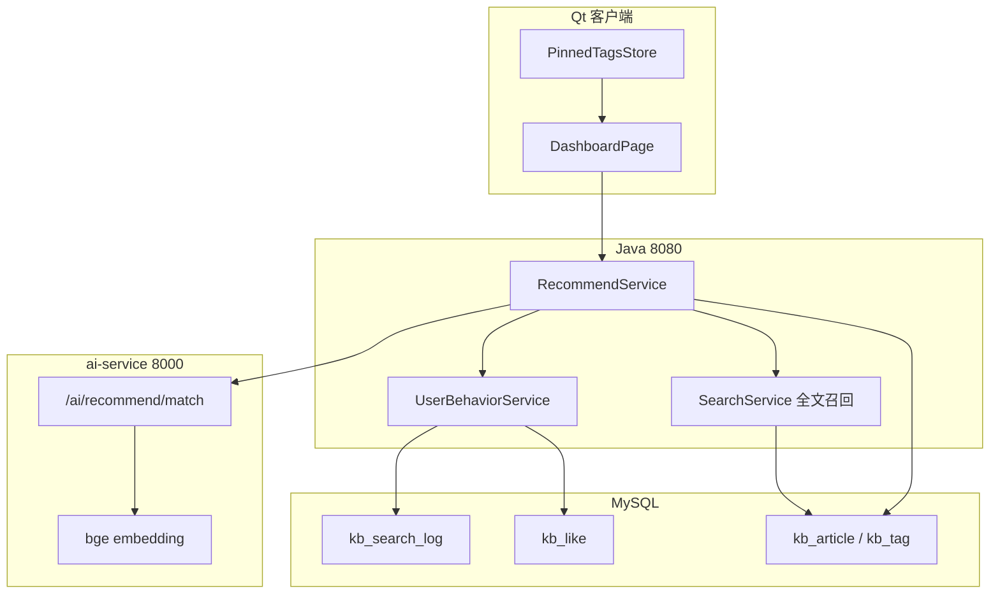

# 首页个性化推荐算法说明

> **模块**：首页「推荐知识」区块（`GET /knowledge/recommend/home`）  
> **实现**：Java `com.kb.recommend.*` + Python `POST /ai/recommend/match` + Qt `DashboardPage`  
> **API 契约**：[`API契约.md`](API契约.md) §5.4  
> **配置**：`server/src/main/resources/application.yml` → `kb.recommend.*`

---

## 1. 设计目标

在首页「热门 TOP5」（全站浏览量）之外，增加一层 **面向当前用户的个性化推荐**：

- 输入：最近搜索、最近点赞、客户端常用标签 pin
- 处理：分层行为画像 → bge 向量语义匹配 → 多路召回 → **兴趣优先 + 热度辅助** 排序
- 输出：默认 Top 5 已上线（`ONLINE`）知识

**与智能问答（QA）的区别**：推荐 **不读 Chroma 向量库**，行为数据在 **MySQL**（搜索/点赞）与 **客户端本地**（pin）；每次请求对标签名/文章文本 **实时 embedding**，与 QA 共用同一 ai-service 进程与 bge 模型。

---

## 2. 总体流程

```text
Qt DashboardPage
  │  PinnedTagsStore → pinnedTagIds
  │  GET /knowledge/recommend/home?limit=5&pinnedTagIds=...
  ▼
Java RecommendService
  │  1. UserBehaviorService 读 MySQL 行为
  │  2. buildProfileSegments → profile_segments
  │  3. AiClient.recommendMatch → Python /ai/recommend/match
  │  4. collectCandidates 多路召回
  │  5. 兴趣分 + 热度分 → finalScore 排序
  │  6. pickDiverse 标签多样性
  ▼
RecommendHomeVO → 首页表格展示
```



---

## 3. 输入：行为数据从哪来

| 信号 | 存储 | 默认窗口/条数 | 用途 |
|------|------|--------------|------|
| **即时搜索** | MySQL `kb_search_log` | 近 **24h**，最多 **3** 个不重复词 | 画像 + 全文召回 + 关键词命中 |
| **近期搜索** | MySQL `kb_search_log` | 近 **7d**，最多 **10** 个词 | 同上（去掉已在即时里的词） |
| **最近点赞** | MySQL `kb_like`（`target_type=ARTICLE`, `type=1`） | 最近 **5** 篇 | 画像 + 召回 + **排除已赞** + 标签加成 |
| **常用标签 pin** | Qt `PinnedTagsStore`（QSettings） | 请求参数 `pinnedTagIds` | 画像 + 向量匹配种子文章 |

**过滤规则**

- 搜索日志只读 `keyword IS NOT NULL AND keyword <> ''`（纯浏览、无关键词的记录不参与推荐画像）
- 仅推荐 `status = ONLINE` 的文章
- 最近点赞的 5 篇文章 **不会出现在推荐结果中**

**无行为降级**：四类信号全空 → `fallback=true`，按全站加权热门返回（不报错）。

---

## 4. 画像分段（ProfileSegment）

`UserBehaviorService.buildProfileSegments()` 按优先级拼最多 4 段文本（有则加，无则跳过）：

| kind | 配置权值 | 文本示例 |
|------|---------|---------|
| `immediate` | 0.45 | `最近搜索：激活；指引` |
| `recent` | 0.25 | `近期搜索：号码激活操作指引` |
| `like` | 0.15 | `最近点赞：《xxx》（标签：a,b）；…` |
| `pin` | 0.15 | `常用标签：高频；投诉` |

发送 Python 前，Java 将 **实际存在的段** 权值归一化到和为 1（缺段时自动放大其余段）。

Python 侧（`ai-service/app/services/recommend.py`）：

1. 每段文本单独 `embed_query`
2. 按权值加权求和后 **L2 归一化** → 用户画像向量
3. 与全库 **标签名**、**候选文章文本**（标题+摘要+标签）算余弦相似度
4. 返回 **Top 5 兴趣标签** + **Top 30 相似文章**（供 Java 排序参考）

---

## 5. 向量匹配请求中的种子文章

`RecommendService.buildMatchRequest()` 组装最多 **120** 篇（`max-embed-articles`）文章送入 Python，来源（按加入顺序、去重截断）：

1. 最近点赞的文章 ID
2. 即时搜索词 → `SearchService.recallArticleIdsByKeyword`（每词 15 篇）
3. 近期搜索词（前 3 个）→ 每词 10 篇
4. pin 标签下文章（每标签 20 篇）
5. 全站按浏览量 Top 80 热门（兜底语义覆盖）

标签侧传入 **全部** `kb_tag`（id + name）。

---

## 6. 候选池：多路召回

向量匹配得到 **Top 5 兴趣标签** 后，`collectCandidates()` 合并以下通道：

| 通道 | 说明 | 默认上限 |
|------|------|---------|
| Top 标签 | `kb_article_tag` 按 tag_id 取文章 | 每标签 **50** 篇 |
| 即时搜索全文 | MySQL `MATCH(title,summary,content)` | 每词 **20** 篇 |
| 近期搜索全文 | 前 3 个近期词 | 每词 **10** 篇 |
| 点赞关联标签 | 从最近点赞文章的标签反查 | 每标签约 **25** 篇 |

- 若仍为空 → 取最近更新 **100** 篇兜底
- 最后 **移除** 最近已点赞的 5 篇

---

## 7. 排序：兴趣分 + 热度分

对候选池内每篇文章计算两个维度，再合成 **finalScore**。

### 7.1 热度分 `hotScore`

基于 `kb_article` 冗余字段（与候选池内其他文章 **相对比较**）：

```text
rawHot = 0.45·ln(1+浏览) + 0.35·ln(1+点赞) + 0.20·ln(1+评论)
hotNorm = min-max 归一化(rawHot) → [0, 1]
```

默认权值见 `kb.recommend.hot-view-weight / hot-like-weight / hot-comment-weight`。

### 7.2 兴趣分 `matchScore`

```text
interestRaw = min(1,
    0.35·articleSim      ← Python 返回的文章向量相似度
  + 0.30·tagSim          ← 文章标签与 Top 标签相似度的最大值
  + 0.25·keywordHit      ← 标题/摘要是否包含用户搜索词
  + 0.10·likeTagBoost    ← 文章标签是否与「最近点赞文章」的标签有交集
)
interestNorm = min-max 归一化(interestRaw) → [0, 1]
```

**keywordHit 细则**

| 来源 | 命中得分 |
|------|---------|
| 即时搜索第 1 词 | 1.00 |
| 即时搜索第 2 词 | 0.88（依次递减 0.12） |
| 近期搜索词 | ≥ 0.65 |

`likeTagBoost`：与最近点赞文章的任一标签名重合 → 1.0，否则 0。

### 7.3 兴趣 vs 热度的动态权重

```text
recentStrength = 0.55·min(1, 即时词数/3)
               + 0.25·min(1, 近期词数/5)
               + 0.20·min(1, 点赞数/3)

wInterest = min(0.85, 0.72 + 0.13·recentStrength)   // 约 72% ~ 85%
wHot      = 1 - wInterest                           // 约 15% ~ 28%
```

行为越「新鲜、丰富」，兴趣权重越高。

### 7.4 最终排序分

```text
finalScore = wInterest · interestNorm + wHot · hotNorm
```

按 `finalScore` **降序**；再用 `pickDiverse`：**同一兴趣标签最多选 2 篇**，不足 `limit` 时按分数补齐。

---

## 8. 输出与前端展示

### 8.1 API 响应要点

| 字段 | 含义 |
|------|------|
| `items[].matchScore` | 兴趣分 `interestNorm`（0~1） |
| `items[].hotScore` | 热度分 `hotNorm`（0~1） |
| `items[].reasonTags` | 与向量 Top 标签匹配的推荐理由（最多 2 个标签名） |
| `profileSummary.keywords` | 展示用搜索词（即时+近期） |
| `profileSummary.topTags` | 向量 Top 标签及 score |
| `profileSummary.source` | `vector` 正常 / `fallback` 降级 |
| `fallback` | `true` 表示本次为热门降级 |

### 8.2 Qt 首页表格

- 区块标题：**推荐知识**
- Hint：`猜你感兴趣：{topTags 或 keywords}`；降级时追加「（已降级为热门推荐）」
- 列：**# / 标题 / 分类 / 兴趣/热门**
- 最后一列单元格：`matchScore / hotScore`（两位小数），例如 `1.00 / 0.69`

---

## 9. 降级（fallback）触发条件

以下任一情况 → `fallback=true`，仅按 **hotNorm**（全站热门抽样）排序，`matchScore=0`：

1. 无行为（搜索/点赞/pin 全空）
2. 画像分段为空
3. 调用 `/ai/recommend/match` 失败（ai-service 未启动、超时、参数校验失败等）
4. 召回候选池为空

降级时 `profileSummary.topTags` 可能为占位（score=0）；若仍有 `keywords`，前端会显示「猜你感兴趣：…（已降级为热门推荐）」。

---

## 10. 可配置项（application.yml）

```yaml
kb:
  recommend:
    search-limit: 10              # 近期搜索最多条数
    like-limit: 5                 # 最近点赞条数
    immediate-search-hours: 24
    immediate-search-limit: 3
    recent-search-days: 7
    top-tags: 5                   # 向量 Top 标签数
    candidate-per-tag: 50
    result-limit: 5
    search-recall-limit: 20
    max-embed-articles: 120
    # 画像分段权值（Python 融合前，缺段归一化）
    profile-weight-immediate: 0.45
    profile-weight-recent-search: 0.25
    profile-weight-recent-like: 0.15
    profile-weight-pinned-tag: 0.15
    # 兴趣 vs 热度
    weight-interest-base: 0.72
    weight-interest-boost: 0.13
    # 兴趣分四分量
    interest-article-sim: 0.35
    interest-tag-sim: 0.30
    interest-keyword-hit: 0.25
    interest-like-tag: 0.10
    # 热度 raw 分
    hot-view-weight: 0.45
    hot-like-weight: 0.35
    hot-comment-weight: 0.20
```

---

## 11. 代码索引

| 层级 | 路径 |
|------|------|
| 入口 API | `server/.../recommend/RecommendController.java` |
| 编排 | `server/.../recommend/RecommendService.java` |
| 行为聚合 | `server/.../recommend/UserBehaviorService.java` |
| 画像分段 | `server/.../recommend/ProfileSegment.java` |
| 热度计算 | `server/.../recommend/HotScoreCalculator.java` |
| 搜索召回 | `server/.../knowledge/search/SearchService.java` |
| AI 客户端 | `server/.../ai/AiClient.java` → `recommendMatch` |
| Python 匹配 | `ai-service/app/services/recommend.py` |
| Python 接口 | `ai-service/app/api/ai.py` → `POST /ai/recommend/match` |
| Qt 首页 | `knowledgeAnswer/app/DashboardPage.cpp` |
| pin 存储 | `knowledgeAnswer/core/config/PinnedTagsStore` |

---

## 12. 运维与排查

| 现象 | 常见原因 |
|------|---------|
| 一直「已降级为热门推荐」 | ai-service(8000) 未启动；Java 调 Python 失败 |
| 有 keywords 但仍降级 | 有行为但向量匹配异常（看 Java 日志 `推荐向量匹配失败，降级热门`） |
| 推荐与 QA 表现不一致 | QA 依赖 Chroma 知识块；推荐不依赖 Chroma，只需 embedding 可用 |
| 搜索了但推荐不变 | 确认 `kb_search_log.keyword` 非空；纯点标签浏览需带 tag 名写入日志 |

**自检**

1. `http://127.0.0.1:8000/health` → UP  
2. 登录后 `GET /api/knowledge/recommend/home?limit=5` → `fallback: false`，`topTags` 有非 0 score  
3. MySQL：`SELECT keyword, create_time FROM kb_search_log WHERE user_id=? ORDER BY create_time DESC LIMIT 10`

---

## 13. 相关文档

- 接口字段与示例 JSON：[`API契约.md`](API契约.md) §5.4  
- 首页 UI 迁移：[`迁移文档/首页与数据统计-迁移指南.md`](迁移文档/首页与数据统计-迁移指南.md)  
- 表结构：`kb_search_log`、`kb_like`、`kb_article`、`kb_tag` — 见 [`数据库表清单.md`](数据库表清单.md)
